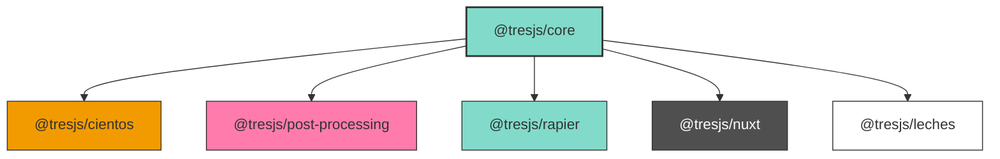

# Tres Architecture

## Overview

Tres is a Vue 3 renderer for Three.js that provides a declarative way to create and manage 3D scenes. The architecture is designed to be modular, extensible, and maintainable, with a clear separation of concerns between core functionality and extensions.



## Ecosystem Structure

### Core Package (@tresjs/core)

The `@tresjs/core` package serves as the foundation of the Tres ecosystem. It provides:

1. **Custom Renderer**: A Vue 3 custom renderer that translates Vue components into Three.js scene graph objects
2. **Core Components**: Essential components like `TresCanvas` and base Three.js object wrappers
3. **Context System**: A robust context system for state management
4. **Composables**: Core composables for scene management and interaction

### Extension Packages

The ecosystem is extended by additional packages that build upon the core:

- **@tresjs/cientos**: Provides additional components and utilities
- **@tresjs/postprocessing**: Post-processing effects
- **@tresjs/rapier**: Physics integration
- **@tresjs/leches**: GUI Controls
- **@tresjs/nuxt**: Nuxt integration

Each package extends the core functionality while maintaining the same architectural principles and patterns established in the core package.

## State Management and Context

### TresCanvas

`TresCanvas` is the root component that orchestrates the entire 3D scene. It:

- Creates and manages the WebGLRenderer
- Initializes the scene graph
- Provides the context for all child components
- Handles canvas sizing and window resizing
- Manages the render loop

```vue
<template>
  <TresCanvas>
    <!-- Scene content -->
  </TresCanvas>
</template>
```

### Context Provider System

The context system is built around `useTresContextProvider` which creates and manages the core state:

```typescript
interface TresContext {
  uuid: string
  scene: ShallowRef<TresScene>
  sizes: SizesType // useSizesReturn
  extend: (objects: any) => void
  camera: UseCameraReturn
  renderer: UseRendererManagerReturn
  loop: RendererLoop
  events?: TresEventManager
  // cientos
  controls: Ref<TresControl | null>

  // nuxt
}
```

Key features:
- Each `TresCanvas` instance creates its own isolated context
- The context is provided to all child components
- State is reactive and can be accessed via composables

## Context Composition

The context is composed of several creation composables:

1. **useRendererManager**: Manages the WebGLRenderer instance
2. **useCameraManager**: Handles camera setup and management
3. **useLoop**: Controls the render loop and animation frame
4. **useTresEventManager**: Manages event handling and raycasting

Example of context composition:
```typescript
const context = useTresContextProvider({
  scene,
  canvas,
  windowSize,
  rendererOptions,
})
```

## State Extension 

Packages like `cientos` extend the Tres state by:

1. **Extending the Catalogue**: Adding new Three.js objects to the component system
2. **Controls Management**: Managing camera controls through the context's `controls` ref

Example with OrbitControls:
```typescript
// In OrbitControls.vue
<script setup lang="ts">
import { extend, useTresContext } from '@tresjs/core'
import { OrbitControls } from 'three/addons/controls/OrbitControls'

extend({ OrbitControls })

const { camera, renderer, controls } = useTresContext()

// The controls ref in the context is used to store the active control
// This allows the control to manage the camera
controls.value = new OrbitControls(camera, renderer.domElement)
</script>
```

The key points about controls in Tres:
- The context provides a `controls` ref that can store the active control
- The control instance is responsible for managing the camera
- Only one control can be active at a time
- The control is automatically cleaned up when the component is unmounted

## API Design and State Access

Tres provides two levels of state access to balance developer experience with flexibility:

### useTres - Simplified API

`useTres` provides a simplified, flattened version of the context for common use cases. It abstracts away the internal state management and provides direct access to the most commonly used properties and methods.

```typescript
// Simplified access to scene elements
const { 
  // Direct access to instances
  camera,      // Active camera instance
  renderer,    // WebGLRenderer instance
  scene,       // Scene instance+
  controls,    // Active controls instance
  
  // Common utilities
  invalidate,  // Renderer invalidate function
  extend,      // Extend catalogue function
  sizes,       // Canvas sizes
  devtoolsRegister,
  
} = useTres()
```


This simplified API is consistent with the state provided by the `useLoop` composable's render callbacks, ensuring a uniform experience across the codebase:

```typescript
const { onBeforeRender } = useLoop()

onBeforeRender(({ camera, renderer, scene, controls }) => {
  // Same simplified API as useTres
  console.log(camera.position)
  renderer.render()
})
```

This consistency ensures that:
- Developers get the same simplified API whether using `useTres` or render callbacks
- The learning curve is reduced as the same patterns apply everywhere
- Code is more maintainable as the same state structure is used throughout

### useTresContext - Advanced API

`useTresContext` provides access to the full context state, including internal state management and advanced features. This is useful for advanced use cases or when building extensions.

```typescript
// Full context access
const {
  // Core state with internal management
  camera: {
    instance: Ref<Camera>,
    cameras: Ref<Camera[]>,
    activeCamera: Ref<Camera>,
    registerCamera: (camera: Camera) => void,
    deregisterCamera: (camera: Camera) => void,
    setCameraActive: (camera: Camera) => void,
  },
  renderer: {
    instance: Ref<WebGLRenderer>,
    invalidate: () => void,
    isReady: Ref<boolean>,
    // ... other renderer state
  },
  // ... other context properties
} = useTresContext()
```